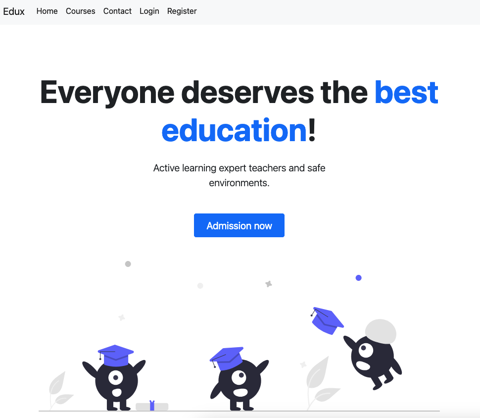

# Edux

Edux is a simple and intuitive Learning Management System (LMS) that makes it easy to manage and deliver online
learning.

There is [live demo](http://185.201.112.170:8081) available.

## Build and Run

App can be easily built and run with [Docker](https://www.docker.com), but it requires some kind of environment
configuration.

### Requirements

- [Docker](https://www.docker.com/products/docker-desktop)
- MySQL database with the proper tables created (see: [edux.schema.sql](src/main/resources/edux_schema.sql))

### Building

1. Create .env file providing MySQL database connection details, it should include:
    - `PROD_MYSQLDB_HOST`
    - `PROD_MYSQLDB_PORT`
    - `PROD_MYSQLDB_DATABASE`
    - `PROD_MYSQLDB_USER`
    - `PROD_MYSQLDB_PASSWORD`
2. Build Docker image: `docker build -t edux .`.

### Running

1. Create Docker container: `docker create -p 8081:8081 --env-file .env --name edux edux`.
2. Start the container: `docker start -ai edux`.

Application should be running on port `8081`.
